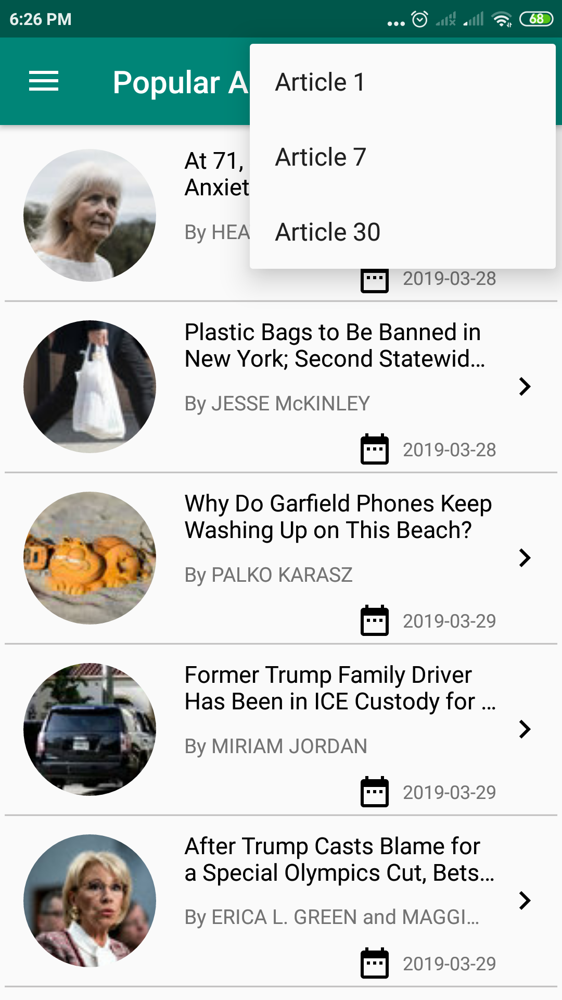

This is just sample application to check NY times popular and most viewed articles.


I have gone through the following links to build this sample application.

Please use this reference for better understanding

[RxJava](https://www.baeldung.com/rx-java) is used to perform process in UIThread and Worker Thread with computation work either.


[Dagger2](https://flutter.io/widgets/layout/) is a fully static, compile-time dependency injection framework for both Java and Android.
```
  DaggerApiBaseComponent
                .builder()
                .apiBaseModule(new ApiBaseModule(context))
                .build()
                .inject(this);
```

[Retrofit2.0](https://square.github.io/retrofit/) is the class through which your API interfaces are turned into callable objects.
```
 @Provides
    @Singleton
    @Named("RootApiRetrofit")
    Retrofit providesRootApiRetrofit(@Named("BasicHttpClient") OkHttpClient client,
                                     GsonConverterFactory converterFactory) {
        return new Retrofit.Builder()
                .addCallAdapterFactory(RxJava2CallAdapterFactory.create())
                .addConverterFactory(converterFactory)
                .client(client)
                .baseUrl(Configuration.BASE_URL).build();
    }
 ```

[Picasso](https://square.github.io/picasso/) allows for hassle-free image loading in your application—often in one line of code.
```
Picasso.get().load("http://i.imgur.com/DvpvklR.png").into(imageView);
```
 

# Sample Demo:

 
 
